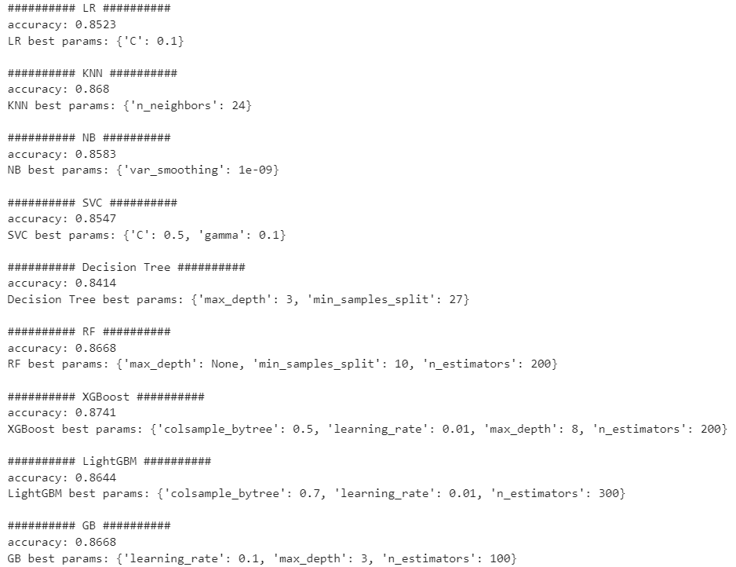
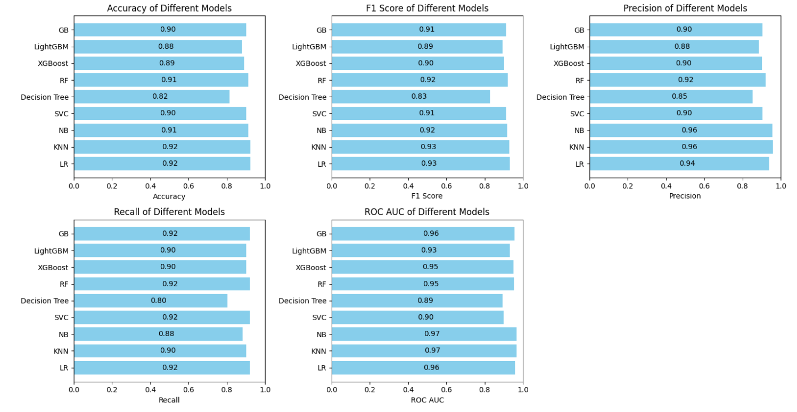
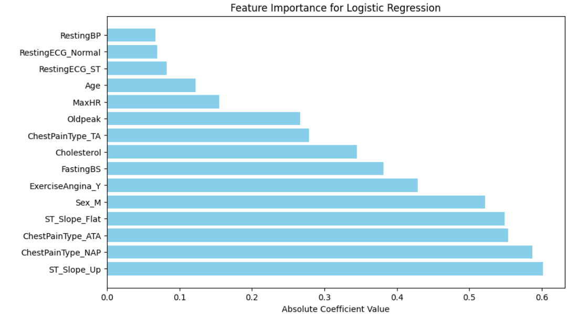

## Модели бинарной и многоклассовой классификации

### Ход работы
1. Определение списка гиперпараметров и моделей
Для ряда классификаторов 
- логистическая регрессия, 
- KNN, 
- наивный байесовский классификатор, 
- SVM, 
- дерево решений, 
- случайный лес, 
- XGBoost, 
- LightGBM
- градиентный бустинг

задаются диапазоны значений гиперпараметров, которые будут использоваться для их настройки
2. Нахождение наилучших гиперпараметров с использованием кросс-валидации на тренировочной выборке(с помощью grid search) для каждого типа моделей

3. Оценка моделей по метрикам
- Accuracy
- F1-мера
- Precision
- Recall
- ROC AUC

на тестовой выборке и выбор лучшей модели

4. Определение важности фичей

