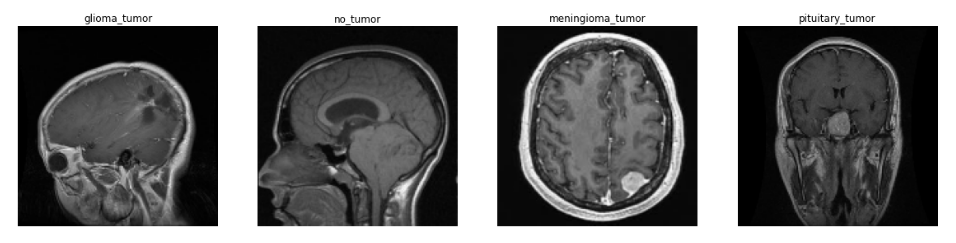
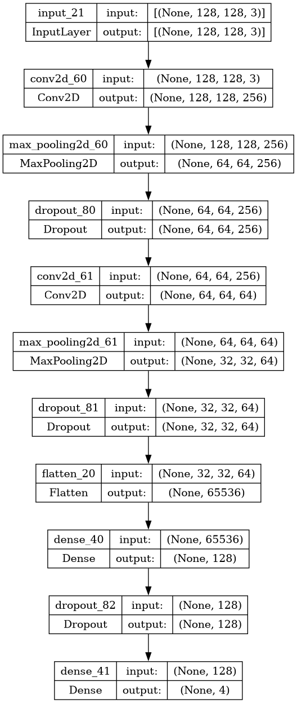
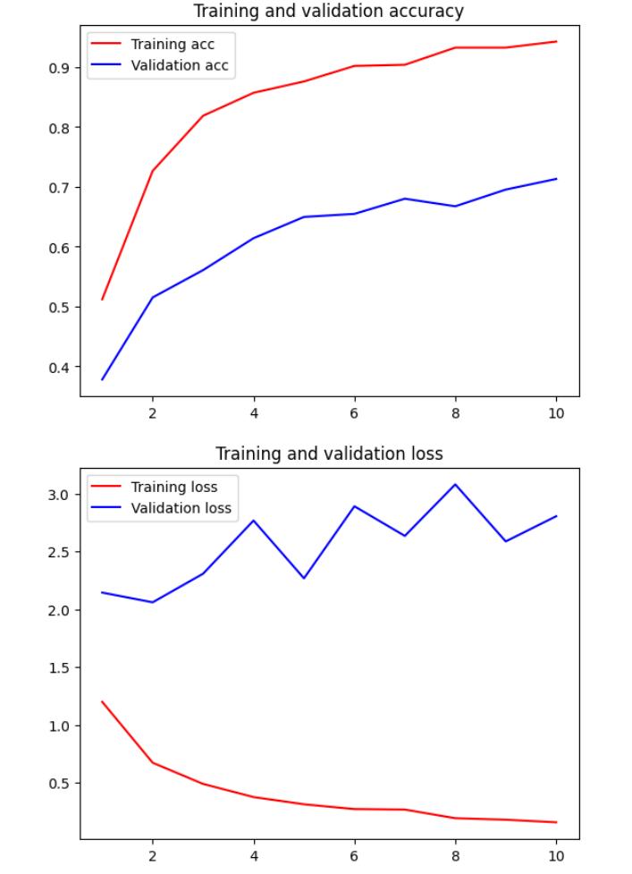
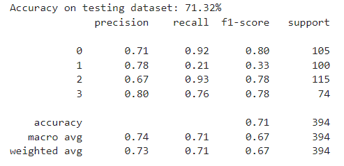
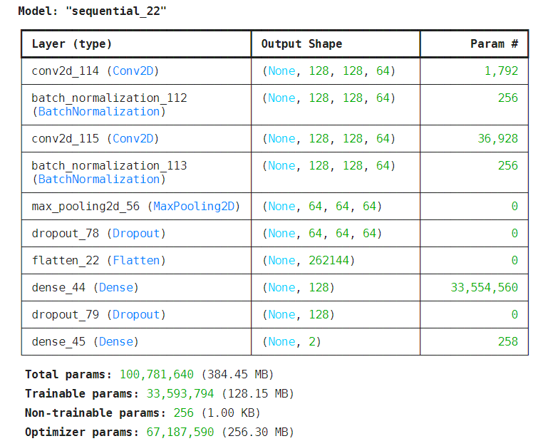

## Сверточные сети для обработки изображений

### Ход работы:

1. Разработка архитектуры свёрточной сети
2. Реализация методов аугментации данных для повышения качества обучения моделей (повороты, отражения, изменение яркости и контраста, масштабирование и обрезка изображений)
3. Оптимизация гиперпараметров модели с помощью библиотеки Optuna. 
4. Тестирование моделей на отложенных выборках данных для оценки их производительности, включающий анализ метрик точности, полноты и F1-меры для оценки качества предсказаний.

### Brain Tumor

Анализ изображений МРТ с разных проекций. Есть разметка с 4 классами 'no_tumor', 'glioma_tumor', 'meningioma_tumor', 'pituitary_tumor'

Модель состоит из блоков, в каждом
- свёрточный слой Conv2D с функцией активации ReLU 
- пуллинг MaxPooling2D(2, 2))
- дропаут для избежания переобучения 

С помощью Optuna были подобраны параметры и кол-во слоёв, получилась следующая структура:

Завершает модель 
- слой Flatten для преобразования в одномерный вектор 
- Dense(128, activation="linear") для связи входных нейронов с выходными 
- Dropout(0.5) также для регуляризации
- Dense(4, activation="softmax"), преобразующий вектор в вероятности для каждого из 4 классов

На данных графиках можно проследить изменения значения функции потерь и accuracy

В итоге получен такой результат

## Pneumonia X-Ray

